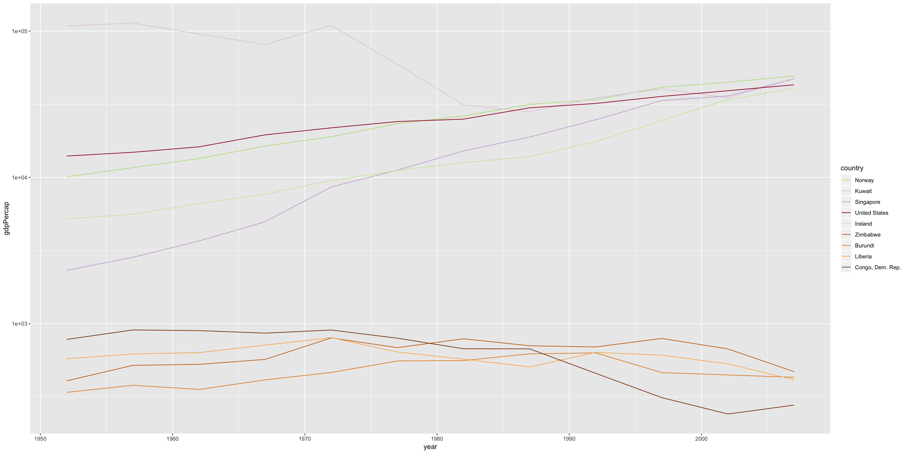

```{r setup, include=FALSE}
knitr::opts_chunk$set(echo = TRUE)
```

## Overview

This Rmarkdown file has several goals as listed below. It will be used as a cheatsheet for future data frame reshaping and data wrangling.  
* Reorder a factor 
* Write and read data using R
* Improve a figure
* Make a plotly visual
* Implement visualization design principles


## Import data frame and the tidyverse pacakge

Gapminder data will be used in this homework, and the dataset will be explored using the "tidyverse" package. Figures will be plotted using the "ggplot2" package.

```{r}
library(gapminder)
library(tidyverse)
library(ggplot2)
# use suppressMessages(library(tidyverse)) to generate a pdf file
```

## Part 1 Factor management
### Overview

This two parts has two goals. Dropping factor/levels, and reordering levels based on understanding of the dataset.

### Drop Oceania
First, let's figure out the structure of the Gapminder dataset before we drop anything out.

```{r}
str(gapminder)
```

It can be noticed that there are 142 levels in country, and 5 levels in continent. Now let's drop the continent "Oceania" out.

```{r}
gap_no_oce <- gapminder %>% 
  filter(continent != "Oceania")
```

```{r}
str(gap_no_oce)
```

After the Oceania has been dropped, the levels of country and continent remained unchanges. Now we want to remove all the unused levels. We could do that using either droplevels() or forcats::fct_drop(). 

Let's try droplevels() first.

```{r}
gap_no_oce %>% 
  droplevels() %>% 
  str()
```

It can be noticed that droplevels() removed unused levels in both country and continent. Oringinally, country has 142 levels and continent has 5 levels. The chunk above removed 2 levels of country and 1 level of continent, resulting in 140 levels in country and 4 levels in continent. 

```{r}
gap_no_oce %>% 
  mutate(continent = fct_drop(continent)) %>% 
  str()
```

The function fct_drop() can specify levels of which factor to remove. Here I only removed unused levels in continent. Oringinally, country has 142 levels and continent has 5 levels. The chunk above only  1 level of continent, resulting in  4 levels in continent, and the levels in country remains unchanged.

### Reorder the levels of continent.

First, let's get a sub-dataset that only has data from the year 2002 to work with. 
```{r}
gap_2002 <- gapminder %>% 
  filter(year == 2002)
```

Let's plot the gdp per capital of different continent using a boxplot, and the mean value of the gdp per capital is indicated as a statistics summary. I found this [webpage](https://stackoverflow.com/questions/50112033/how-do-i-plot-the-mean-instead-of-the-median-with-geom-boxplot) useful. 

```{r}
gap_2002 %>% 
  ggplot(aes(x = continent, y = gdpPercap, fill=continent))+
  geom_boxplot(fatten = NULL) +
  stat_summary(fun.y = mean, geom = "errorbar", aes(ymax = ..y.., ymin = ..y..),
               width = 0.75, size = 1, linetype = "solid")
```


To reorder the levels of continent based on the gdpPercap in decreasing. Let's try arrange() first.  
```{r}
gap_2002 %>% 
  arrange(desc(gdpPercap)) %>% 
  ggplot(aes(x = continent, y = gdpPercap, fill=continent))+
  geom_boxplot(fatten = NULL) +
  stat_summary(fun.y = mean, geom = "errorbar", aes(ymax = ..y.., ymin = ..y..),
               width = 0.75, size = 1, linetype = "solid")
```

It shows that arrange() won't change the order of the continent in the figure. Now let's try fct_reorder().

```{r}
gap_2002 %>% 
  mutate(continent = fct_reorder(continent, gdpPercap, fun = mean, .desc = TRUE)) %>% 
  ggplot(aes(x = continent, y = gdpPercap, fill=continent))+
  geom_boxplot(fatten = NULL) +
  stat_summary(fun.y = mean, geom = "errorbar", aes(ymax = ..y.., ymin = ..y..),
               width = 0.75, size = 1, linetype = "solid")
```

It shows fct_reorder() can reorder the continent by gdpPercap in decreasing order. How about using factor reordering coupled with arrange()?

```{r}
gap_2002 %>% 
  arrange(desc(gdpPercap)) %>% 
  mutate(continent = factor(continent, unique(continent))) %>% 
  ggplot(aes(x = continent, y = gdpPercap, fill=continent))+
  geom_boxplot(fatten = NULL) +
  stat_summary(fun.y = mean, geom = "errorbar", aes(ymax = ..y.., ymin = ..y..),
               width = 0.75, size = 1, linetype = "solid")
```

The above chunk also help us to reorder levels in a factor using arrange() and factor(). However, it only can reorder based on the largest value of each continent rather than the mean value. I would prefer not using this one because it is hard for us to specify the criteria of reordering. 

## Part 2 File I/O
### Overview
This part will write a sub-dataset of Gapminder to a .csv file and then read it back in.

First, let write gap_2002 onto a .csv. The gap_2002 dataset will be reordered by gdpPercap to make sure it is not ordered alphabetically. 

```{r}
gap_2002 %>% 
  arrange(desc(gdpPercap)) %>% 
  write_csv("gap_2002.csv")
```

Then, read the gap_2002.csv back in R.

```{r}
gap_2002_new <- read_csv("gap_2002.csv")
head(gap_2002_new)
```

It can be notice that the dataframe that is read from the .csv file has the same order with the arranged gap_2002 dataframe, which is ordering by decreasing of gdpPercap.

## Part 3 Visualization design.
In this part, several graphs will be ploted and compared with each other. Scale of one axis will be manipulated and the font size of axis will be changed using theme(). Some of the graphs will be plotted using ggplot2, and some will be plotted using ploty.

Using the Gapminder dataset, and plot the trend of gdpPercap of a few countries, and some of them have a large gdpPercap value that is greater than 40000 in the year 2007, and the others have a small gdpPercap value that is smaller thatn 1000 in the year 2007. Using the country color sheme. 

First, let's get two groups of countries.

```{r}
country_large_gdp <- gapminder %>% 
  filter(year == "2007", gdpPercap >= 40000) %>% 
  select(country) %>% 
  droplevels()
country_small_gdp <- gapminder %>% 
  filter(year == "2007", gdpPercap <= 500) %>% 
  select(country) %>% 
  droplevels()
```

Then let's make the plot.

```{r}
dat1 <- gapminder %>% 
  filter(country %in% country_large_gdp$country)
dat2 <- gapminder %>% 
  filter(country %in% country_small_gdp$country)
dat_all <- bind_rows(dat1, dat2)
p_country_col <- dat_all %>% 
  ggplot(aes(year, gdpPercap, col = country))+
  scale_colour_manual(values = country_colors) +
  geom_line()
p_country_col
```


In the first attempt, I found that the trend of gdpPercap of countries that has low gdpPercap is not illustrative, and I think the reason is the gap bwteen the gdpPercap values of two groups is large. So let's try to log the y axis.

```{r}
p_country_col_log <- p_country_col + 
  scale_y_log10()
p_country_col_log
```

Compare this figure to the first one, it can be noticed that the trend of both groups are clearly shown. The graph itself is more illustrative. However, the order of the legend does not correspond the order of the lines. Let's make the legend is in order of the last gdpPercap.

```{r}
p_reorder <- dat_all %>% 
  mutate(country=fct_reorder2(country, year, gdpPercap)) %>% 
  ggplot(aes(year, gdpPercap, col = country))+
  scale_colour_manual(values = country_colors) +
  geom_line() +
  scale_y_log10()
p_reorder
```

It can be noticed that the order of the legend matches with the order of gdpPercap of 2007. Now let's make the text of axis x and y bigger, and give the graph a title.

```{r}
p_title <- p_reorder + 
  labs(x = "Year",
  y = "GDP Per Capita",
  title = "Change of GDP Per Capita over time") +
  theme_bw() +
  theme(axis.text = element_text(size = 16))
p_title
```

It can be notice that the labels in this plot is clearer than the previous ones, and the title of the graph makes it easy to understand.


To conver the graphs to a 'plotly' plot.

```{r}
library(plotly)
ggplotly(p_title)
```

```{r}
ggplotly(p_reorder)
```

"plotly" plot has many advantages over the "ggplot2" plot. There are a number of functions such as downloading plot, zooming in and out, reset axes, autoscale and etc. at the top right corner of the plot. Also, it will show you the value of y and x axis when you put your cursor on the line plotted in the graph. These are two features that ggplot2 does not have. Also, though it is not shown here, "plotly" can plot a graph that is 3-D.

## Part 4 Writing figures to file.
To save the graphs in part 3 to my local disk using ggsave(). One graph will be saved in vector format, e.g. pdf, and another one will be saved in raster format, e.g. png.

First, let's save the p_title as pdf.
```{r}
ggsave("~/Downloads/STAT545/hw05-liuyadong08/gdpPercap_title.pdf", plot = p_title, width = 20, height = 10)
```

Now let's try to save p_reorder as png without specifying the plot. 

```{r}
ggsave("~/Downloads/STAT545/hw05-liuyadong08/gdpPercap_reorder_wrong.png", width = 20, height = 10)
```

The chunk above FAILED to save the p_reorder graph since the plot argument is not specified here. It will save the graph that is in the memory of R. Let's specify the plot as p_reorder and try again.


```{r}
ggsave("~/Downloads/STAT545/hw05-liuyadong08/gdpPercap_reorder_correct.png", plot = p_reorder, width = 20, height = 10)
```

Last but not least, load those graphs back to the report. 





